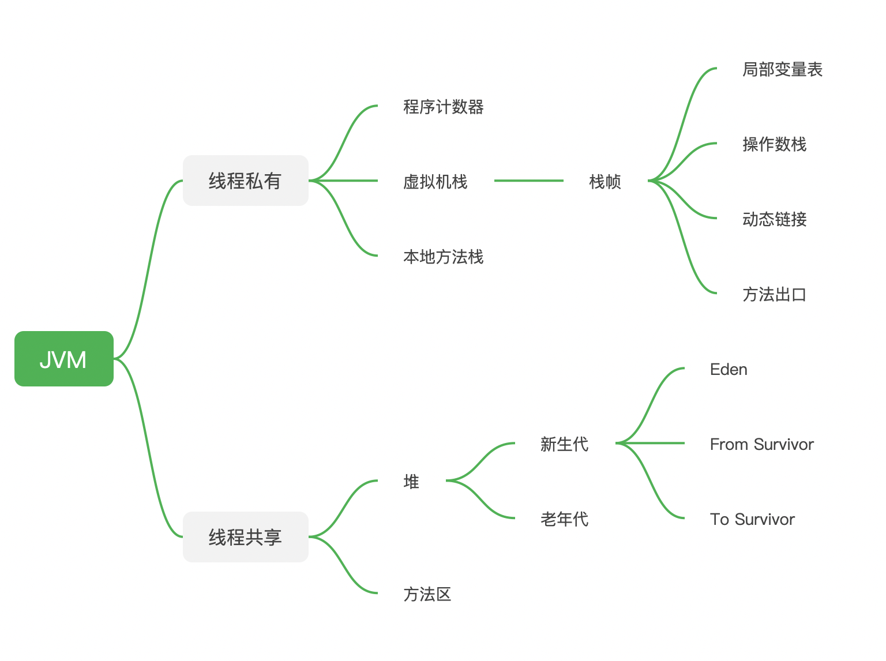
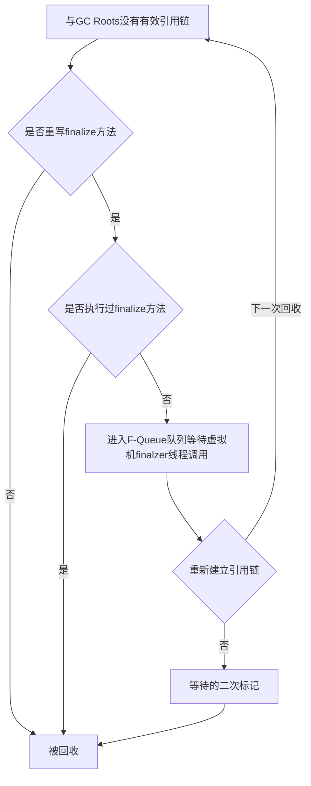
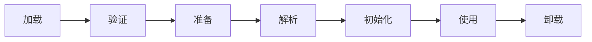

# JVM

### 内存结构
1. 程序计数器（线程私有）
    - 当前线程执行字节码的行号指示器
    - 执行Native方法时为空
    - 此区域没有OOM
2. 虚拟机栈（线程私有）
    - 栈帧：存放局部变量表、操作数栈、动态链接、方法出口等
    - 局部变量表：存放编译器可知的各种基本数据类型
    - 会抛出SO和OOM
3. 本地方法栈（线程私有）
    - Hotspot中与虚拟机栈合二为一
    - 会抛出SO和OOM
4. 方法区（共享）
    - 存储被虚拟机加载的类信息、常量、静态变量、即时编译后的代码等数据
    - 也叫No-heap
    - hotspot中用永久代实现方法区
    - 会抛出OOM
    - 运行时方法区：
        + 存放编译期生成的常量
        + 运行期也可将常量放入常量池，如String.intern()
        + 会抛出OOM
5. 堆（共享）
    - 最大的一块线程共享内存区域
    - 用于存放对象实例
    - 垃圾收集器工作的主要区域
    - 还可细分为：
        + Eden
        + From Survivor
        + To Survivor
    - 通常使用 -Xmx和-Xms参数控制
    - 当堆不发再扩展时抛出OOM
    
7. 直接内存
    - 会抛出OOM
    - NIO直接分配堆外内存，DirectByteBuffer最为这块内存的引用进行操作

### 判断对象存活方法
+ 引用计数法：
    - 简单效率高
    - 存在循环引用问题，A.instance=B,B.instance=A
+ 可达性分析法：
    - 从GC Roots开始向下搜索，所走的路径称为引用链，当从GC Roots到某个对象不可达时则对象为可回收对象
    - GC Roots对象包括：
        + 虚拟机栈中引用的对象
        + 方法区中类静态属性引用的对象
        + 方法区中常量引用的对象
        + 本地方法栈中JNI

### 强引用，软引用，弱引用，虚引用
+ 强引用：普遍存在，如Object obj = new Object()
+ 软引用：用来描述一些有用，但非必须的对象，SoftReference类实现，当系统内存即将溢出时，会回收这部分对象，可以用来实现简单的缓存
+ 弱引用：更弱一些，只能存活到下一次垃圾收集发生前，WeakReference类实现
+ 虚引用：唯一作用，被回收时收到系统通知，PhantomReference类

### finalize()方法
任何一个finalize方法都只会被系统自动调用一次，如果finalize方法执行缓慢或者死循环会导致F-Queue队列中其他对象永久等待，甚至导致内存回收系统崩溃

### 垃圾收集算法
+ 标记清除算法
    + 分两个阶段，先标记再回收
    + 两个不足，效率不高，会产生大量不连续的内存空间
+ 复制算法
    + 将内存划分成两块，只使用其中一块，当内存满了，把还存活的复制到另外一块上，再把当前的一次性清理掉。
    + 简单，快，缺点内存缩小，存活率较高时，复制操作较多，效率会变低。
    + Hotspot中，新生代内存中，分为一块较大的Eden区和两块较小的Survivor(分别是From和To)默认为8：1，主要原因是java中98%的对象都是朝生夕死，一般新对象在Eden区产生（大对象有担保原则直接进入老年代），这些新对象经历过一次Minor GC后会进如Survivor区，在Survivor区每经历过一次Minor GC他的年龄就会加1，当GC开始时，对象只会存在于Eden区和From Survivor，Eden区内存活对象会复制到To Survivor，From Survivor中年龄满足的进去老年代，不满足的复制到To Survivor，清空Eden和From Survivor，此时的To和From交换身份，等待下一GC重复这个动作
+ 标记整理算法
    + 先标记，在将内存像一端移动，直接清理边界外的内存
+ 分代收集算法
    现在都分代

### 垃圾收集器
+ 新生代：
    - **serial**：复制算法，单线程收集器，工作时必须暂停其他所有工作线程，直到收集结束
    - **ParNew**：标记复制算法，serial的多线程版本。server模式下首选，除了serial只有它能与CMS收集器配合工作
    - **Parallel**：复制算法，并行多线程收集器，达到一个可控的吞吐量，吞吐量= 用户代码运行时间/(用户代码运行时间 + 垃圾收集时间)，适合在后台运算不需要太多交互的任务
+ 老年代：
    - **serial old**：标记整理算法，单线程
    - **parallel old**：标志整理算法，多线程
    - **CMS（Concurrent Mark Sweep）**：并发收集器，标记清除算法，以最短停顿时间为目标的收集器。 适合互联网网站B/S架构服务。

+ 
+ 各JDK版本默认垃圾收集器
    - jdk1.7 parallel scavenge + parallel old
    - jdk8 parallel scavenge + parallel old
    - jdk9 G1
  使用 XX:+PrintCommandLineFlags可查看默认收集器类型
  使用 XX:+PrintGCDetails可通过打印新生代老年代的名称判断

### 什么情况下会出现Full GC
+ System.gc()调用
+ 老年代空间不足
+ 永久区空间不足
+ CMS GC时出现promotion failed和concurrent mode failure
+ 堆中分配很大的对象

### JDk工具
+ jps：虚拟机进程查看
    jps -lvm 显示完整main方法，jvm参数
+ jstat： 虚拟机统计信息监视工具，命令行显示虚拟机中的类装载、内存、垃圾收集、JIT编译等运行数据
    jstat -gc pid 间隔时间 总次数
+ jmap：用于生成heapdump
+ jhat：分析dump文件
+ jstack：java 堆栈跟踪工具
+ jconsole：可视化监视管理工具
+ visalVM：功能比较全，还提供性能分析等工具

### 类在虚拟机中的生命周期

### 类加载器
+ 两个类比较，只有在被同一个类加载器加载的前提下才有意义，如equal,instanceof等关键字。
+ 三种：
    - 启动类加载器 Bootstrap ClassLoader
    - 扩展类加载器 Extension ClassLoader
    - 应用程序类加载器 Application ClassLoader

### 双亲委派模型
如果一个类加载器收到了类加载的请求，它首先不会自己加载，而是把这个请求委托给父类加载，每一层类加载器都是如此，最后所有的请求都会传到顶层的启动类加载器中，只有当父类自己无法完成这个加载请求，它的搜索范围中找不到所需的类，子加载器才会自己加载

### Reflection和MethoHandle
+ 反射是java代码层面的方法调用，MethodHandle是在模拟字节码层次的方法调用。
+ 反射是重量级，而MethodHandle是轻量级的

### Java语法糖
+ 泛型和类型擦除
+ 自动装箱、拆箱、遍历循环

### 逃逸分析
分析对象作用域，当一个对象在方法中被定义后，它可能被外部方法所引用，例如：
   - 方法逃逸：作为参数传递到其他方法
   - 线程逃逸：复制给类变量或者其他线程中访问的变量
如果证明一个对象不会逃逸到方法之外，也就是别的线程或方法无法访问到实例对象，则可为这个对象进行一些高效优化：
    - 栈上分配
    - 同步消除
    - 标量替换
开启逃逸分析 -XX:+DoEscapeAnalysis
开启后可通过 -XX: +PrintEscapeAnaysis查看分析结果
有了逃逸分析的支持后可以使用 -XX:+EliminateAllocations开启标量替换

### 先行发生原则 happens-before
如果A操作现行发生于B操作，那么A操作产生的影响对B操作是可见的。