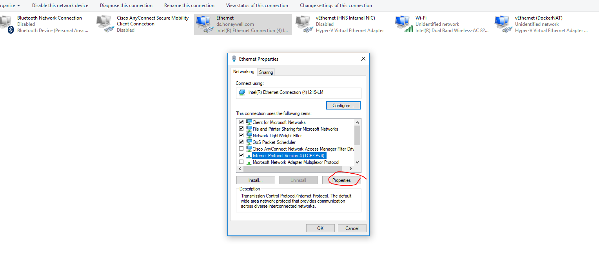
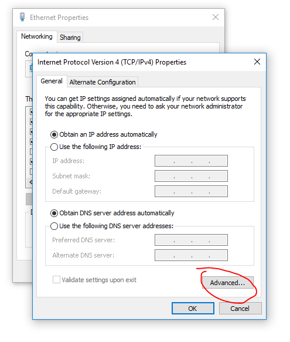
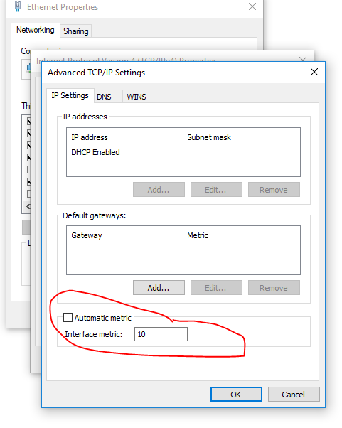
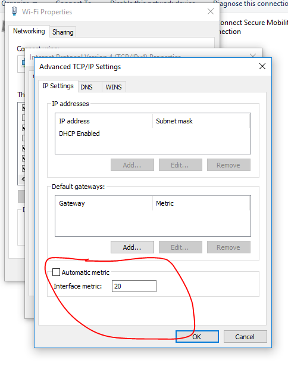
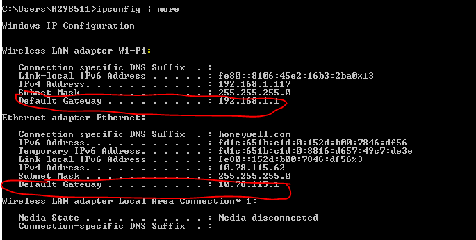
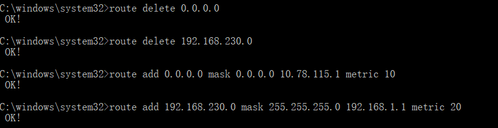

### 配置网卡优先级
+ 将有线网卡优先级设置为10,值越小优先级越高。  



+ 无线网卡优先级设置为20。


### 设置路由规则
+ 管理员身份运行CMD

+ 查看网卡信息


+ 设置网卡路由规则
删除已存在路由规则,可通过route print -4查看，重启后会失效，加 -p 参数重启后不会失效
```bash
route delete 0.0.0.0
route delete 192.168.230.0
```
添加有路由规则
```bash
route add 0.0.0.0 mask 0.0.0.0 10.78.115.1 metric 10
route add 192.168.230.0 mask 255.255.255.0 192.168.1.1 metric 20
```



