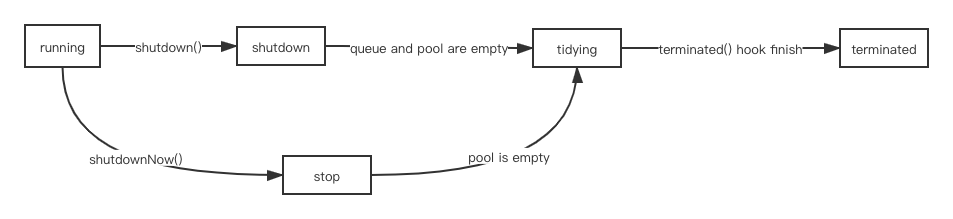

## Java线程池运行原理


### 什么是线程
线程是调度CPU的最小单元，也叫轻量级进程  

两种线程模型：
1. 用户线程（ULT）
    不依赖操作系统核心，由应用自己管理线程的生命周期，不需要用户态内核态状态切换，速度快
2. 内核线程（KLT）
    系统内核管理的线程，内核保存线程运行上下文信息，阻塞不会导致进程阻塞

java虚拟机使用的KLT

### 为什么要使用线程池
线程的创建需要消耗资源


### 线程池生命周期



+ **RUNNING**: 接受新任务，同时也会执行队列中的任务
+ **SHUTDOWN**: 不接受新任务，但队列中的任务会继续执行
+ **STOP**: 不接受新任务，不执行队列中的任务，并且会打断执行中的任务
+ **TIDYING**: 所有任务都已经终止，并且worker数量为0，SHUTDOWN状态会在队列为空和工作线程清理完后进去这个状态，STOP状态在清理完工作线程后会进入这个状态，会执行钩子方法terminated()方法
+ **TERMINATED**: terminated()方法执行完毕后进入此状态，线程池完全停止

### 相关属性
```java
    // 核心元子类，高3位表示线程池运行状态，低29位表示线程数
    private final AtomicInteger ctl = new AtomicInteger(ctlOf(RUNNING, 0));

    private static final int COUNT_BITS = Integer.SIZE - 3;

    // 容量
    private static final int CAPACITY   = (1 << COUNT_BITS) - 1;

    // 111
    private static final int RUNNING    = -1 << COUNT_BITS;

    // 000
    private static final int SHUTDOWN   =  0 << COUNT_BITS;

    // 001
    private static final int STOP       =  1 << COUNT_BITS;

    // 010
    private static final int TIDYING    =  2 << COUNT_BITS;

    // 011
    private static final int TERMINATED =  3 << COUNT_BITS;

    // 阻塞队列，存放任务
    private final BlockingQueue<Runnable> workQueue;


    private final ReentrantLock mainLock = new ReentrantLock();

    // 存放所有线程
    private final HashSet<Worker> workers = new HashSet<Worker>();
        
    private final Condition termination = mainLock.newCondition();

    // 达到的最大线程数量统计
    private int largestPoolSize;

    // 完成的任务数量统计
    private long completedTaskCount;

    // 线程工厂
    private volatile ThreadFactory threadFactory;

    // 拒绝策略
    private volatile RejectedExecutionHandler handler;

    // 非核心线程存活时间
    private volatile long keepAliveTime;

    // 设置为true后，keepAliveTime也将对核心线程适用
    private volatile boolean allowCoreThreadTimeOut;

    // 核心线程数
    private volatile int corePoolSize;

    // 最大线程数
    private volatile int maximumPoolSize;

    // 默认拒绝策略
    private static final RejectedExecutionHandler defaultHandler =
        new AbortPolicy();

    // 线程池关闭权限控制
    private static final RuntimePermission shutdownPerm =
        new RuntimePermission("modifyThread");

```

### 添加任务
```java
public void execute(Runnable command) {
        if (command == null)
            throw new NullPointerException();
        int c = ctl.get();
        // 1. 判断是都达到核心线程数
        if (workerCountOf(c) < corePoolSize) {
            // 1.1 未达到核心线程数则添加新worker
            //   通过cas自旋添加
            if (addWorker(command, true))
                return;
            c = ctl.get();
        }
        // 2. 已经达到核心线程数，如果当前线程状态为RUNNING添加任务进队列
        if (isRunning(c) && workQueue.offer(command)) {
            int recheck = ctl.get();
            // 再次判断线程次运行状态
            if (! isRunning(recheck) && remove(command))
                reject(command);
            // 如果线程为0，添加worker
            else if (workerCountOf(recheck) == 0)
                addWorker(null, false);
        }
        // 3. 添加任务进队列失败，尝试添加非核心线程处理任务
        else if (!addWorker(command, false))
            // 填加非核心线程失败，则拒绝任务
            reject(command);
    }
```
