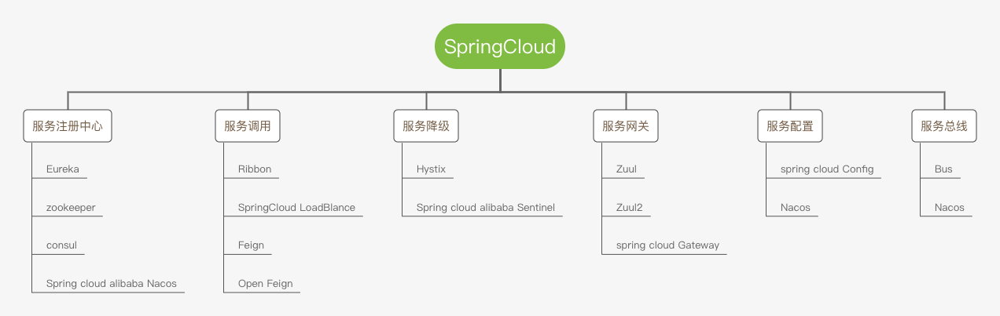

# Spring Cloud



## Ribbon
负载均衡组件


#### 负载均衡策略
+ **RoundRobinRule** 轮询策略
+ **RandomRule** 随机策略
+ **RetryRule** 先按照RoundRobin方式获取服务，如果获取服务失败会在指定时间内充实获取可用服务
+ **WeightedResponseTimeRule** 对RoundRobin的扩展，相应时间越快的选中的权重越高
+ **BestAvaiableRule** 会过滤掉多次访问故障而处于短路器跳闸状态的服务，然后选择一个并发量最小的服务
+ **AvailabilityFilteringRule** 过滤到故障示例，选择并发量最小的服务
+ **ZoneAvoidnceRule** 复合判断server所在区域性能和server的可用性选择服务

#### 配置策略
1. **这个配置类不能放在@CompentScan当前包及子包下**
2. 新建配置类
    ```java
    @Configuration
    public class MyRuleConfig {
        
        @Bean
        public IRule myRule(){
            return new RandomRule();
        }
    }
    ```
3. 添加@RibbonClient注解
    ```java
    
    @SpringBootApplication
    @RibbonClient(name="DEMO-SERVICE", configuration = MyRuleConfig.class)
    public class TestApplication {

        public static void main(String[] args) {
            SpringApplication.run(PersonApplication.class, args);
        }

    }
    ```

