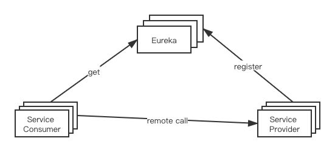

# Spring Cloud


--------------
## Eureka


#### 自我保机制
Eureka Server运行期间会会统计15分钟内心跳低于85%的服务实例，Eureka Server会将这些服务保护起来防止其过期，但是如果此时正好服务下线，会导致客户端获取到已经失效实例，所以需要客户端有一定容错机制，如重试、短路器等。
可以通过以下配置关闭
```properties
eureka.server.enable-self-preservation=false
```
自我保护机制的意义在于，避免因为网络故障而导致服务不可用，例如A、B两个服务，A和B之间是网路互通的，但是由于网络问题，B未能及时向Eureka发送心跳，这个时候不能简单的把B服务剔除，而导致A无法从Eureka获取B服务，而是将B保护起来，等待其网络恢复


#### 与Consul相比
+ CAP原则，Eurka高可用，弱一致性，consul强一致性
+ Eureka高可用性原理
    - 注册相对较快，不保证注册信息都备份到其他节点，也不保证注册信息是否备份成功
    - 当两个节点信息不一致时，仍可正常对外提供服务
+ Consul强一致性原理
    - 注册信息必须过半数节点写入成功才认为注册成功
    - leader重新选举期间服务不可用


--------------------
## Ribbon
负载均衡组件


#### 负载均衡策略
+ **RoundRobinRule** 轮询策略
+ **RandomRule** 随机策略
+ **RetryRule** 先按照RoundRobin方式获取服务，如果获取服务失败会在指定时间内充实获取可用服务
+ **WeightedResponseTimeRule** 对RoundRobin的扩展，相应时间越快的选中的权重越高
+ **BestAvaiableRule** 会过滤掉多次访问故障而处于短路器跳闸状态的服务，然后选择一个并发量最小的服务
+ **AvailabilityFilteringRule** 过滤到故障示例，选择并发量最小的服务
+ **ZoneAvoidnceRule** 复合判断server所在区域性能和server的可用性选择服务

#### 配置策略
1. **这个配置类不能放在@CompentScan当前包及子包下**
2. 新建配置类
    ```java
    @Configuration
    public class MyRuleConfig {
        
        @Bean
        public IRule myRule(){
            return new RandomRule();
        }
    }
    ```
3. 添加@RibbonClient注解
    ```java
    
    @SpringBootApplication
    @RibbonClient(name="DEMO-SERVICE", configuration = MyRuleConfig.class)
    public class TestApplication {

        public static void main(String[] args) {
            SpringApplication.run(PersonApplication.class, args);
        }

    }
    ```

