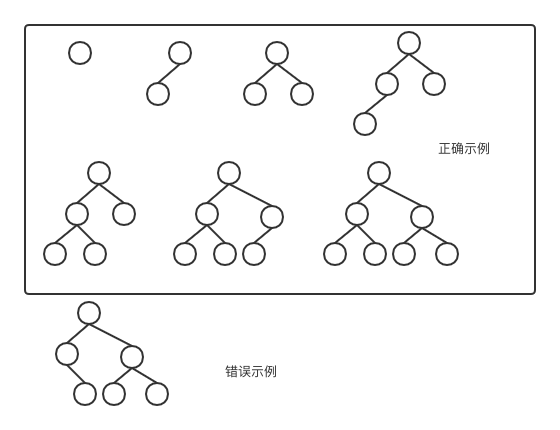

## 堆
堆数据结构必须满足两个条件: 
    1. 必须是一棵完全二叉树（若设二叉树的深度为k，除第 k 层外，其它各层 (1～k-1) 的结点数都达到最大个数，第k 层所有的结点都连续集中在最左边，这就是完全二叉树）
    2. 所有的父节点值大于子节点值



## 如何构建一个堆
从完全二叉树的底层开始对每棵子树进行heapify(将三个节点中最大值交换到父节点)


## 堆排序实现代码

```java
public class HeapSort {

    private static void swap(int[] array, int i, int j){
        int tmp = array[i];
        array[i] = array[j];
        array[j] = tmp;
    }
    
    private static void heapify(int[] array, int n, int i){
        if(i >= n) return;
        // 计算两个子节点下边
        // c1 = i*2 + 1;
        // c2 = i*2 + 2;
        int c1 = 2*i + 1;
        int c2 = 2*i + 2;
        // 计算出最大值坐标
        int maxIndex = i;
        if(c1 < n && array[c1] > array[maxIndex]){
            maxIndex = c1;
        }
        if(c2 < n && array[c2] > array[maxIndex]){
            maxIndex = c2;
        }
        // 如果最大值不是i本身，交换
        if(maxIndex != i){
            swap(array, maxIndex, i);
            // 继续
            heapify(array, n, maxIndex);
        }
    }

    private static void buildHeap(int[] array, int n){
        int lastIndex = n - 1;
        // 计算最底层子树的父节点
        int parent = (lastIndex-1)/2;
        // 从最底层子树开始heapify
        for(int i = parent; i >= 0; i--){
            heapify(array, n, i);
        }
    }


    private static void heapSort(int[] array, int n){
        buildHeap(array, n);
        for(int i = n -1; i >= 0; i--){
            swap(array, i, 0);
            heapify(array, i, 0);
        }
    }

    public static void main(String[] args) {
        int[] array = new int[]{9,3,4,7,5,4};
        heapSort(array, array.length);
        IntStream.of(array).forEach(System.out::println);
    }
}
```
输出
```bash
3
4
4
5
7
9
```